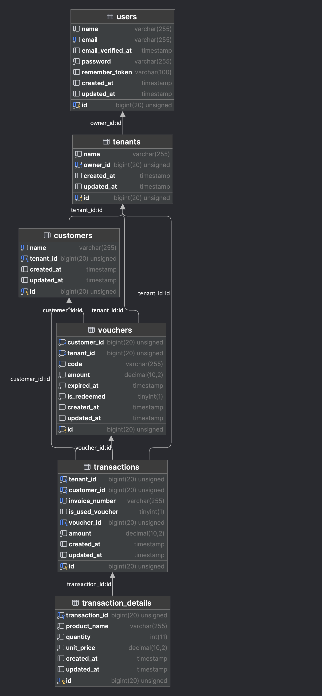
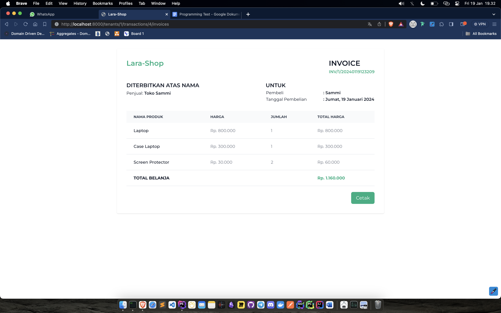

# Daftar Isi
- [Aplikasi Royalty](#aplikasi-royalty)
- [Software yang dibutuhkan](#software-yang-dibutuhkan)
- [Langkah-langkah instalasi](#langkah-langkah-instalasi)
- [Skema Database](#skema-database)
- [Teknologi / library yang digunakan](#teknologi--library-yang-digunakan)
- [Important Environment Variables for dynamic configuration](#important-environment-variables-for-dynamic-configuration)
- [Fitur dan Screnshoot Aplikasi](#fitur-dan-screnshoot-aplikasi)

<a name="aplikasi-royalty"></a>
# Aplikasi-Royalty
This sofware was created for royalty management based on this specification:

`A mall wants to make a royalty program. For every 1,000,000 rupiahs spent on a mall tenant, will award a 10,000 rupiahs voucher to the registered customer. To get the voucher, the customers need to show the tenant invoice. This invoice will have a unique transaction ID and can only be used once. This voucher has a unique code that can only be used once. Each voucher has expired time for 3 months. Make a program and database to distribute and redeem the voucher (including registration and transaction). Make using CodeIgniter 4 or Laravel 10.`

<a name="software-yang-dibutuhkan"></a>
# Software yang dibutuhkan

1. [XAMPP](https://www.apachefriends.org/download.html) atau [Laragon](https://laragon.org/download/)
2. [Git](https://git-scm.com/downloads) 
3. [Composer](https://getcomposer.org/download/)
4. [Laravel 10](https://laravel.com/docs/8.x/installation)
5. [NodeJS](https://nodejs.org/en/download/)

<a name="langkah-langkah-instalasi"></a>
# Langkah-langkah instalasi

```bash
  # Clone repository
  git clone -v https://github.com/SemmiDev/lara-royalty.git lara-royalty
  atau
  Download ZIP file
```

```bash
  # Masuk ke folder lara-royalty 
  cd lara-royalty
```

```bash
  # Install dependencies yang dibutuhkan laravel
  composer install
```

```bash
  # Install dependencies untuk frontend
  npm install && npm run dev
```

```bash
  # Copy file .env.example menjadi .env
  cp .env.example .env
```

```bash
  # Generate key untuk aplikasi
  php artisan key:generate
```

```bash
  # Buat database baru sekaligus migrasi tabel
  php artisan migrate
```

```bash
  # Buat data dummy
  php artisan db:seed
```

```bash
  # Jalankan aplikasi
  php artisan serve
```

<a name="skema-database"></a>
# Skema Database


<a name="teknologi--library-yang-digunakan"></a>
# Teknologi / library yang digunakan
- Laravel 10 (PHP Framework)
- TailwindCSS (CSS Framework)
- AlpineJS (Javascript Framework)
- Flowbite (TailwindCSS UI Kit)
- MySQL (Database)
- SweetAlert2 (Alert Library)
- Laravel Reliese (Model Generator)
- Laravel Breeze (Authentication Scaffolding)

<a name="important-environment-variables-for-dynamic-configuration"></a>
# Important Environment Variables for dynamic configuration

Target total transaksi untuk mendapatkan satu voucher. Jadi, ketika total transaksi mencapai 1000.000, maka akan mendapatkan 1 voucher

```
TARGET_TRANSACTION_AMOUNT_FOR_VOUCHER=1000000
```

Jumlah amount untuk 1 voucher. Jadi, 1 voucher akan bernilai 10.000
```
VOUCHER_AMOUNT=10000
```

Durasi voucher dalam satuan hari. Jadi, voucher akan expired dalam 90 hari / 3 bulan setelah dibuat
```
VOUCHER_DURATION_IN_DAYS=90
```

<a name="fitur-dan-screnshoot-aplikasi"></a>
# Fitur dan Screnshoot Aplikasi
- [x] Halaman Pendaftaran


- [x] Halaman Login


- [x] Halaman Daftar Toko


- [x] Pop Up Form Tambah Toko


- [x] Halaman Daftar Toko (Setelah toko dibuat)


- [x] Halaman Daftar Pelanggan


- [x] Halaman Membuat Transaksi


- [x] Halaman Riwayat Transaksi


- [x] Halaman Invoice Transaksi


- [x] Halaman Request Voucher


- [x] Halaman Voucher Terbuat


- [x] Status transaksi setelah digunakan untuk voucher


- [x] Halaman Status voucher (indikator telah digunakan atau belum)


- [x] Halaman Belanja dengan voucher


- [x] Halaman Invoice Belanja dengan voucher


- [x] Halaman Status voucher (indikator telah digunakan atau belum)


- [x] Halaman Riwayat Transaksi (setelah voucher digunakan)


- [x] Halaman Transaksi Baru


- [x] Halaman Invoice Transaksi Baru


- [x] Halaman Redeem Voucher


- [x] Halaman Voucher Berhasil Digunakan

